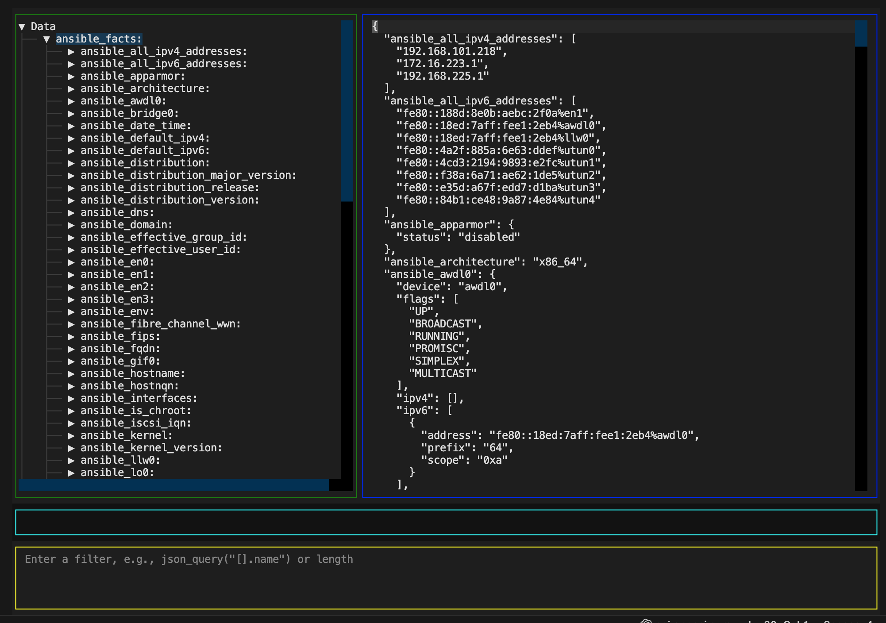

# this2that, by Steve Maher.

This2that data transformation testing tool for Ansible that runs in a terminal and is designed for developers of ansible to be able to easily maniplulate data structures within ansible into other data structures to be used in loops or templates.

This tool was bourne out of frustration at creating small python scripts to find issues with data transformations and/or running playbooks multiple times to resolve issues with unexpected data transformation with ansible/j2 filters.


# How to use

Save your data, within your playbook or store your data using a call back such as tree.

```yaml
 - name: Save data
   copy:
     content: "{{ vars | to_nice_yml }}"
     path: /tmp/my_vars.yml
```


For help using the tree callback.
```shell
ansible-doc -t callback tree

# Create a localhost file in /tmp/tree
ansible -m setup -c local -i localhost, --tree /tmp/tree all
this2that /tmp/tree/localhost

```




